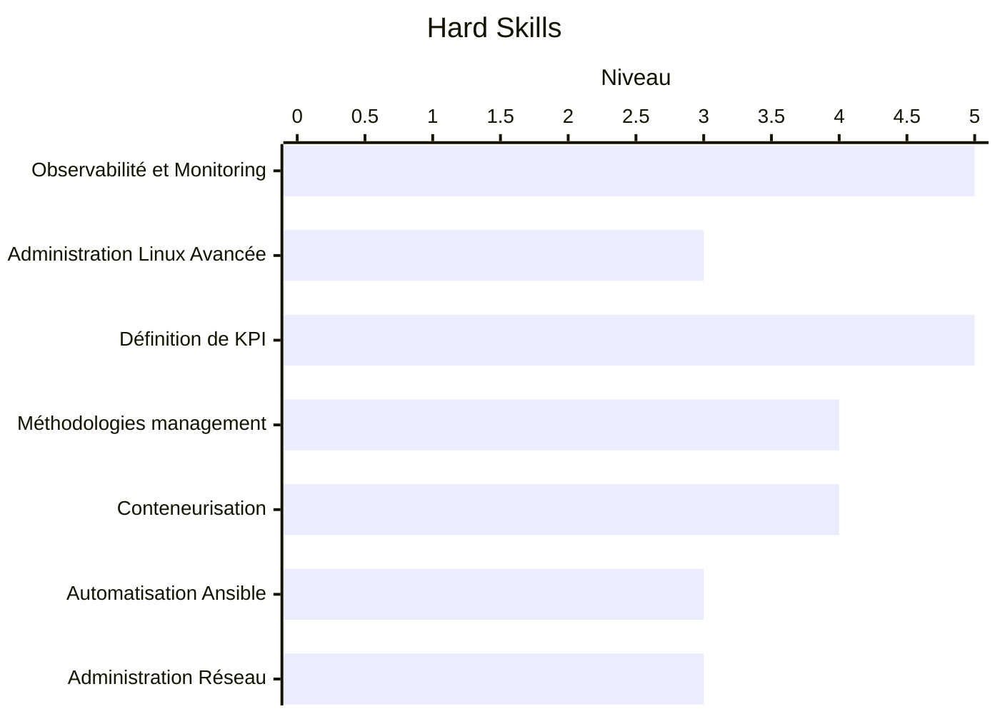
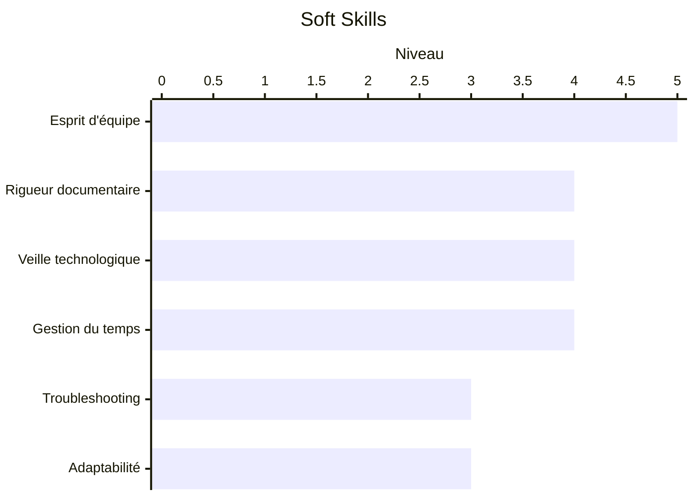

# Damien BANACH

**Alternant OPS / DevOps, Administrateur Systèmes & Réseaux**
Mastère MICSI (Manager en Infrastructure et Cybersécurité des SI), CESI Orléans

📍 45480, Ingré · ✉️ damien.banachpro@outlook.fr · 🚗 Permis B véhiculé

---

## À propos

Actuellement en alternance en tant qu'Ops/DevOps chez **Relyens**, je m'appuie sur un parcours solide en administration systèmes, réseaux et infrastructure pour évoluer vers des sujets de cybersécurité et d'automatisation. Curieux, entreprenant et à l'écoute, j'aime résoudre des problèmes techniques concrets et fiabiliser les environnements sur lesquels je travaille.

En parallèle, j'utilise régulièrement les LLMs (Claude, API) au quotidien et je monte en compétence sur l'IA à travers des projets personnels, en l'intégrant à la fois comme outil d'aide au développement et comme brique d'analyse de données.

---

## Projets personnels

### Outil d'analyse de télémétrie (simulation automobile, Le Mans Ultimate)
*Phase de conception*

Outil personnel visant à traiter et analyser les données de télémétrie issues de jeux de simulation automobile (Le Mans Ultimate). L'IA est mobilisée à deux niveaux : en support au développement de l'outil (génération et structuration du code), et pour l'analyse des données de télémétrie elles-mêmes (extraction d'insights, détection de tendances de pilotage).

*Stack envisagée : Python (traitement de données, appels API LLM)*

---

## Expérience professionnelle

### Relyens, Olivet, Sept. 2025 / Sept. 2027
**Alternant OPS, DevOps / Administrateur Système**
- Exploitation quotidienne de l'infrastructure
- Résolution d'incidents et traitement des tickets de niveau 3
- Développement de scripts d'automatisation
- Mise en place de procédures techniques
- Participation au patch management et à la gestion des CVE

*Technologies : Kubernetes, MSSQL, Rundeck, Ansible, GitHub, Vault*

### Cloud Temple, 2024 / 2025
**Alternant, équipe d'expertise réseau**
- Gestion des incidents réseaux et construction des infrastructures clients
- Maquettage des problématiques clients en laboratoire
- Mise en œuvre de la supervision et automatisation (Terraform / Ansible / Cloud-init)
- Création de procédures techniques et intégration aux projets

### Antares, Région Centre, 2022 / 2024
**Technicien support N2**

---

## Formation

| Période | Établissement | Diplôme |
|---|---|---|
| 2025 / 2027 | CESI Orléans | Mastère MICSI (Manager en Infrastructure et Cybersécurité des SI), alternance |
| 2024 / 2025 | CESI Orléans | Bachelor Administrateur Système et Réseau |
| 2022 / 2024 | Aftec Orléans | BTS SIO option SISR, 16.20/20, 3ᵉ académique |
| 2019 / 2022 | Université d'Orléans | Licence Physique · Baccalauréat Scientifique (2019) |

---

## Compétences

**Réseau & Sécurité**
Juniper · Fortinet · Cisco · Firewalls/Switchs · ITIL

**Cloud & Automatisation**
Kubernetes · Terraform · Ansible · Rundeck · Cloud-init · GitHub · Vault

**Systèmes**
Windows Server · Linux · Active Directory · ESX/ESXi · MSSQL

**Autres**
Anglais B2 · Gestion de tickets/incidents

**Niveaux (auto-évaluation sur 5)**

---

## Savoir-être

Entreprenant · À l'écoute · Curieux · Esprit d'équipe · Persévérant

**Niveaux (auto-évaluation sur 5)**

## Projet professionnel

Feuille de route de mon évolution de carrière :

| Horizon | Cible |
|---|---|
| Court terme | Administrateur DevOps |
| Moyen terme | Product Owner |
| Long terme | Engineering Manager |

---

## Centres d'intérêt

Sport mécanique · Cinéma · Jeux vidéo

---
